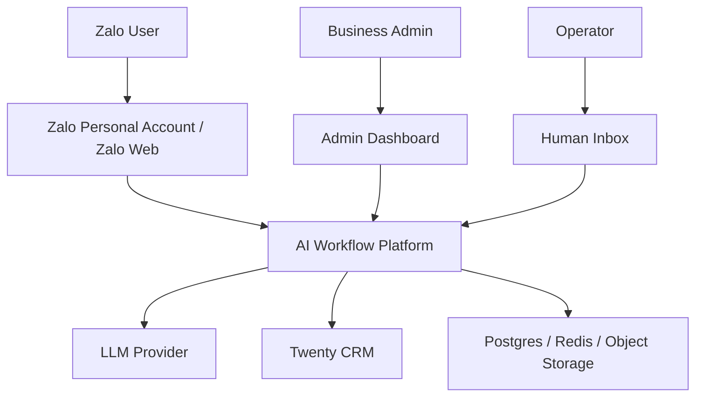
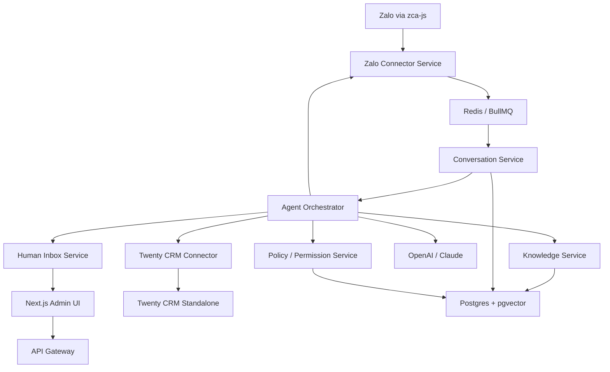
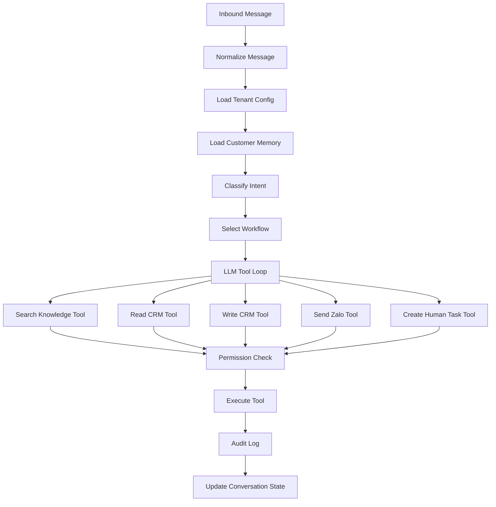

# Architecture

## Direction

Use microservice boundaries, but build them inside a single TypeScript monorepo first.

Reasoning:

- the services can keep clean contracts and separate deployment paths,
- the team avoids premature operational overhead,
- shared types, linting, testing, and local development stay simple,
- the Zalo connector can be isolated and replaced later without rewriting core workflows.

Recommended repo shape:

- `apps/admin`
- `services/api`
- `services/worker`
- `services/zalo-connector`
- `packages/shared`
- `packages/config`
- `packages/database`
- `packages/testing`

## Key Constraints

### Zalo Connector Risk

`zca-js` should be treated as a disposable adapter, not as a stable foundation.

- it is an unofficial Zalo personal-account API that automates Zalo Web,
- account lock or ban risk exists,
- only one active web listener should run per account at a time,
- the connector must be isolated behind a narrow interface.

References:

- [zca-js GitHub](https://github.com/RFS-ADRENO/zca-js)
- [zca-js npm](https://www.npmjs.com/package/zca-js/)

### Twenty Strategy

Use Twenty as a standalone CRM, not as the main app database.

- configure normal CRM data through Twenty UI or metadata-driven APIs,
- prefer standard objects where possible,
- add custom fields or custom objects only when the vertical requires them,
- avoid forking Twenty source unless the CRM UI itself becomes a hard blocker.

References:

- [Twenty Data Model](https://docs.twenty.com/getting-started/core-concepts/data-model)
- [Twenty APIs](https://docs.twenty.com/developers/extend/capabilities/apis)

## Recommended Stack

- monorepo: `pnpm` + `Turborepo`
- frontend: `Next.js`
- backend services: `NestJS` or `Fastify` with TypeScript
- database: `Postgres`
- vector search: `pgvector`
- queue: `Redis` + `BullMQ`
- workflow engine later if needed: `Temporal`
- event bus later if needed: `NATS`
- AI: OpenAI or Claude with internal tool layer
- CRM: self-hosted Twenty
- Zalo: `zca-js` inside isolated connector service
- observability: `Sentry`, `OpenTelemetry`, structured logs
- secrets: encrypted DB fields first, `Vault` or `Infisical` later

## Context Diagram



## Container Diagram



## Agent Flow



## Ownership Boundary

The platform database should store:

- tenants,
- Zalo sessions,
- messages,
- conversations,
- AI runs,
- tool calls,
- permissions,
- workflow configs,
- knowledge chunks,
- audit logs.

Twenty should store:

- CRM records,
- contacts and organizations,
- opportunities or vertical-equivalent pipeline records,
- follow-up tasks,
- human-readable notes,
- operator pipeline views.

## Build Phases

### Phase 1: Foundations

- set up monorepo with `apps/admin`, `services/api`, `services/worker`, `packages/shared`
- start Postgres, Redis, and Twenty
- design core DB schema for tenants, messages, conversations, workflows, and audit logs
- create shared TypeScript types for message, contact, workflow, and CRM actions

Parallelizable:

- A: monorepo setup
- B: infrastructure bootstrap
- C: core schema
- D: shared contracts

### Phase 2: Zalo Connector

- build `zca-js` login and session manager
- add QR login and encrypted session storage
- add listener watchdog and reconnect logic
- normalize Zalo events into internal message format
- publish inbound messages to queue
- implement outbound send-message command

### Phase 3: Twenty Connector

- configure Twenty standalone workspace
- create API key with limited role
- implement CRM adapter
- add metadata discovery for field mapping
- add idempotency protection for contact and pipeline writes

### Phase 4: Agent Runtime

- implement message processing worker
- add intent classification
- add tool-calling loop with max turns
- add permission gates: `auto`, `approval`, `manual`, `blocked`
- add audit log for every decision and tool call
- add fallback behavior when confidence is low

### Phase 5: Workflow Builder

- add business profile management
- add lead, candidate, and inquiry field configuration
- add CRM mapping management
- add auto-reply and handoff rules
- add tone, language, business hours, and blocked-topic rules

### Phase 6: Knowledge Base

- upload docs and FAQ content
- chunk and embed into `pgvector`
- add knowledge search tool
- add source citation for internal audit
- add unanswered-question reporting

### Phase 7: Human Inbox

- conversation list
- takeover mode
- approve or reject AI draft
- assign owner
- create follow-up task
- show CRM context beside chat

### Phase 8: Production Hardening

- rate limits per tenant and Zalo account
- retry and dead-letter queues
- session expiry alerts
- connector health checks
- data retention controls
- tenant isolation tests
- audit export
- backup and restore plan

## Connector Interface

The channel layer should remain replaceable:

```ts
interface ChannelConnector {
  receiveMessage(): Promise<InboundMessage>;
  sendMessage(input: OutboundMessage): Promise<SendResult>;
  getContactProfile(id: string): Promise<ContactProfile>;
}
```

Example implementations:

```ts
class ZcaJsConnector implements ChannelConnector {}
class OfficialZaloOaConnector implements ChannelConnector {}
class WhatsAppConnector implements ChannelConnector {}
class MessengerConnector implements ChannelConnector {}
```
