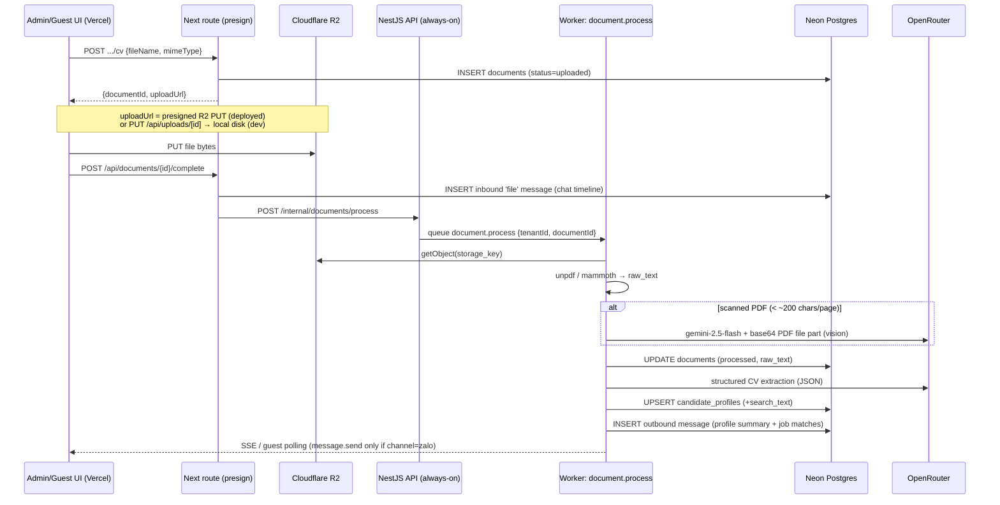
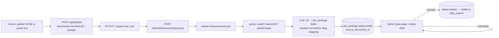
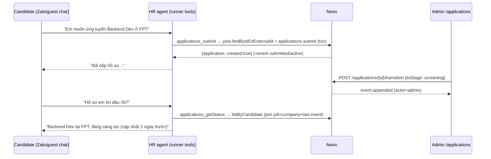
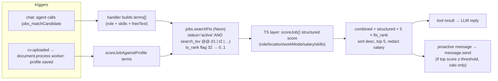
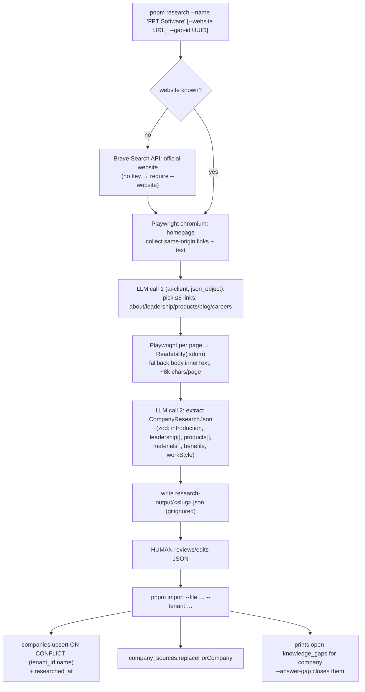
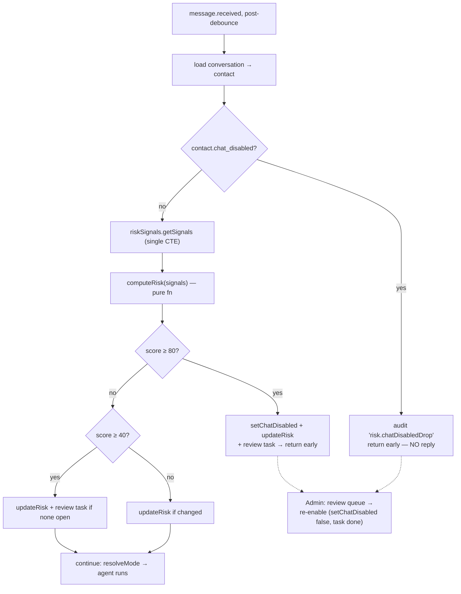

# Master Plan: 6 Missing Features — zalo-twenty-platform

> **Detailed per-feature specs** (full DDL, repo signatures, file-by-file changes, numbered steps + verification) live in `docs/plans/2026-07-16-missing-features/`:
> [00-foundation](2026-07-16-missing-features/00-foundation.md) · [01-cv-to-profile](2026-07-16-missing-features/01-cv-to-profile.md) · [02-jd-to-job-drafts](2026-07-16-missing-features/02-jd-to-job-drafts.md) · [03-company-research](2026-07-16-missing-features/03-company-research.md) · [04-job-matching](2026-07-16-missing-features/04-job-matching.md) · [05-fraud-detection](2026-07-16-missing-features/05-fraud-detection.md) · [06-application-tracking](2026-07-16-missing-features/06-application-tracking.md)
> This document is the overview: context, locked decisions, migration order, phases, and the parallel-subagent map.

## Context

The Zalo recruiting chatbot works end-to-end for text chat (connector → API → BullMQ worker → agent → reply), but is missing the data backbone of a real recruiting product. Six features close the gap: CV ingestion, JD ingestion, company research, job-fit matching, fraud detection, and application tracking. A CV pipeline stub exists (`cv.uploaded` queue + `cv-extractor.ts`) but never downloads file bytes, is gated to twenty-mode, and the upload route writes to `public/uploads` (breaks on Vercel) — it gets **replaced, not patched**.

## Locked decisions (user-confirmed)

- One master plan, phased; migrations first; all 6 features in scope.
- **File storage: Cloudflare R2** (S3-compatible); object key in DB, extracted text in Postgres.
- Phase-1 CV source: **admin/guest upload UI only** (real Zalo file download deferred).
- **Search: hybrid** — Postgres FTS + existing structured scoring now; schema pgvector-ready; embedding rerank later (OpenRouter has no embeddings endpoint; needs an OpenAI/Gemini key when added).
- **Company research: local CLI** in the repo (Node + Playwright + existing `ai-client`), separate import command. Schema must not preclude a SaaS crawl API later.
- **Fraud: flag + human review** (reuse `human_tasks`); auto-disable only above a hard threshold; disabled contacts are silently dropped (no reply — don't teach scrapers the threshold).

## Codebase facts the plan builds on

- Neon Postgres, raw `pg` Pool (`max: 1`), numbered SQL migrations in `packages/database/migrations/` (latest `08_companies.sql`), factory repositories in `packages/database/src/repositories.ts` aggregated by `createRepositorySet`.
- pgvector enabled but unindexed; **no tsvector/FTS anywhere yet**. No `candidates` or `applications` tables.
- Agent skills = SKILL.md docs (compiled into `skills-content.ts` by root `scripts/generate-skills-content.ts` — regenerate after adding skills) + Vercel AI SDK `tool()` handlers in `packages/agent/src/skills/registry.ts`; the pattern to copy is `createQueryCompanyTool(ctx)` (injected DB callback, mock fallback) with lazy repo singletons in `packages/agent/src/core/runner.ts` (`getJobsRepo()`/`getCompanyRepo()`).
- Worker (`services/worker/src/main.ts`) is the only always-on compute; admin (Next.js on Vercel, `maxDuration=60`, no Redis) reaches queues via NestJS API internal endpoints (`API_BASE_URL` + `INTERNAL_INGEST_TOKEN`). Queues: `message.received`, `message.send`, `crm.sync`, `human.task.create`, `knowledge.embed`, `dead-letter`. No cron.
- Guest chat polls the DB for replies, so `message.send` must be gated on `conversation.channel === 'zalo'`.
- LLM: OpenRouter via `packages/ai-client` (`google/gemini-2.5-flash` etc.). Vietnamese-language product.
- `pnpm-workspace.yaml` globs: `apps/* | services/* | packages/*` — new CLI goes in `packages/`, not `tools/`.

## Shared infrastructure decisions

- **One `documents` table** (`kind = 'cv' | 'jd'`) + **one BullMQ queue `document.process`** with kind-dispatch — CV and JD share ~90% of the pipeline (R2 download → text extraction → LLM structuring → persist). `cv-extractor.ts` and the `cv.uploaded` queue are retired.
- **New `packages/storage`** with two drivers behind one interface (`putObject`, `getObject`, `getUploadTarget`, `presignGet`):
  - **`r2` driver** (deployed): `@aws-sdk/client-s3` + presigner; `getUploadTarget` returns a presigned PUT URL so the browser uploads direct to R2 (bypasses Vercel's ~4.5MB body limit; needs a one-time R2 CORS rule).
  - **`local` driver** (dev, user decision): writes to a gitignored directory on disk (`LOCAL_UPLOAD_DIR`, default `<repo>/.data/uploads/`, keyed by the same `storage_key`); `getUploadTarget` returns an app-local URL (`PUT /api/uploads/[documentId]`, a Next route that streams the body to `putObject`); `getObject` reads the file. Worker and admin share the path when running on the same machine (the local dev setup).
  - Selection: `createStorage(env)` picks `r2` when the R2 env vars are set, else `local`. The `documents.storage_key` format is identical in both, so switching drivers needs no data migration.
- **FTS strategy: English-first (user decision)**: use Postgres's built-in `'english'` text-search config (stemming included) for both job and candidate tsvectors — match terms are dominated by English tech vocabulary (React, Java, DevOps) and structured scoring carries the load anyway. No diacritic-normalization layer, no `search_text` staging column; tsvectors are generated columns directly over the source fields (arrays via an immutable `array_to_string` wrapper). Vietnamese-language search is explicitly deferred; the documented increment if needed later is an additional `'simple'`-config column (additive migration).

## Migration order (09–16)

| # | File | Feature |
|---|------|---------|
| 09 | `09_documents.sql` | shared: uploaded docs (R2 key, raw_text, status, provenance FKs) |
| 10 | `10_candidate_profiles.sql` | F1: structured profile + search_text tsvector + `embedding vector(1536)` |
| 11 | `11_job_posting_status.sql` | F2: `status draft/active/archived` + `source_document_id`, **drop `is_active`** |
| 12 | `12_applications.sql` | F6: `applications` + `application_events` |
| 13 | `13_company_research.sql` | F3: companies research columns + `company_sources` |
| 14 | `14_knowledge_gaps.sql` | F3.1: `knowledge_gaps` |
| 15 | `15_job_search_fts.sql` | F4: immutable `array_to_string` wrapper, `search_tsv` generated column + GIN, `embedding vector(1536)` on job_postings (no index yet) |
| 16 | `16_risk_detection.sql` | F5: contacts risk columns, `profile_change_log`, audits index, `human_tasks` type check gains `'review'` |

---

# Feature 1 — CV upload → candidate profile

## Design

Two-step presigned upload; processing always in the worker.

## Key tables

**`documents`** (09): `id, tenant_id, kind ('cv'|'jd'), storage_key, file_name, mime_type, size_bytes, status ('uploaded'|'processing'|'processed'|'failed'), parse_method, raw_text, error`, provenance FKs (`contact_id, guest_access_id, conversation_id, company_id`, all nullable, `on delete set null`), `uploaded_by ('admin'|'guest'|'zalo')`. GIN index on `to_tsvector('english', raw_text)`.

**`candidate_profiles`** (10): one per contact or guest (partial unique indexes on `(tenant_id, contact_id)` / `(tenant_id, guest_access_id)`; check: at least one owner). Fields: `full_name, email, phone, location, current_title, years_of_experience numeric(4,1), skills text[], preferred_roles text[], salary_expectation_vnd, availability, work_history jsonb, education jsonb, languages text[], summary, raw_extraction jsonb, source_document_id`. Search: `search tsvector generated always as (to_tsvector('english', coalesce(full_name,'') || ' ' || coalesce(current_title,'') || ' ' || f_array_to_string(skills,' ') || ' ' || f_array_to_string(preferred_roles,' ') || ' ' || coalesce(location,'') || ' ' || summary))` + GIN (the `f_array_to_string` immutable wrapper migrates in 09/10 since it's now needed early); GIN on `skills`; `embedding vector(1536)` nullable for later.

## Components

- **`packages/agent/src/core/document-processor.ts`** (replaces `cv-extractor.ts`): `startDocumentWorker`, registered in worker **unconditionally** (no twenty-mode gate). Parse: `unpdf` (PDF) / `mammoth.extractRawText` (docx) / passthrough (txt); scanned-PDF heuristic `rawText.length/pageCount < 200` → LLM vision fallback (base64 PDF file part to gemini-2.5-flash; cap uploads ~8MB). CV branch: extend existing `CV_EXTRACTOR_SYSTEM_PROMPT` JSON contract with work_history/education/languages/summary; persist via `candidateProfiles.upsert`; call `clearHrAgentProfileCache()` after upsert; outbound summary + top job matches, `message.send` only for zalo channel.
- **Routes**: rewrite `apps/admin/src/app/api/conversations/[conversationId]/cv/route.ts` (presign flow); new `POST /api/documents/[documentId]/complete`; new guest `POST /api/guest/[code]/cv` + upload button in guest UI. NestJS: `internal-documents.controller.ts` → `QueueService.enqueueDocumentProcess`.
- **Agent rewiring**: `crm_getCandidateProfile` / `crm_updateCandidateProfile` / `crm_addCandidateProfileNote` handlers gain optional `CandidateProfileContext { getProfile, updateProfile }` (DB-first, mock fallback — same degradation as `jobs_search`). Runner adds `getCandidateProfileRepo()` / `getContactsRepo()` singletons; default-mode `CustomerProfileCache` loader switches from mock to DB-backed when `PLATFORM_DB_URL` set. Notes stored in `raw_extraction.notes` array.
- **Repos**: `createDocumentRepository` (create, findById, markProcessing/Processed/Failed, listByTenant), `createCandidateProfileRepository` (upsert with merge + search_text recompute, findByContact/Guest/Id, hybrid `search`).

## Libraries

| Purpose | Pick | Over | Why |
|---|---|---|---|
| PDF text | **unpdf** | pdf-parse (unmaintained, CJS import crashes), pdfjs-dist raw (verbose worker wiring) | Serverless pdfjs build, native ESM, `extractText(buffer)` one-liner, per-page counts feed the scanned-PDF heuristic |
| DOCX | **mammoth** | docx4js/textract | battle-tested pure JS; legacy `.doc` rejected at upload with Vietnamese error (YAGNI) |
| Scanned PDF | **LLM vision via existing OpenRouter** (gemini-2.5-flash) | Tesseract | no native OCR dep; already have the model factory |
| S3 client | **@aws-sdk/client-s3 + s3-request-presigner** | aws4fetch (manual signing), minio-js | Cloudflare's documented R2 path; presigner built in; weight irrelevant server-side |

---

# Feature 2 — JD upload → job breakdown (draft → review → activate)

Reuses the entire CV pipeline; only the extraction+persist branch differs. Pasted text = document with `parse_method='plain-text'`, `raw_text` prefilled, parse skipped.

- **Migration 11**: `job_postings.status ('draft'|'active'|'archived') default 'active'` + `source_document_id`; backfill `archived` from `is_active=false`; **drop `is_active`** (same PR updates `listActive`/`count`/`bulkInsert` in repositories.ts, plus `services/worker/scripts/twenty/parse-jobs-to-sql.ts`, root `jobs_insert.sql`, and check `apps/admin/src/lib/types.ts:48`).
- Worker JD branch: LLM outputs the `job_postings` field contract (title, requiredSkills, salary VND, locationSlugs constrained to `locations` table slugs via `packages/agent/src/core/location-normalizer.ts`, workMode, seniority, jobType, experience, benefits, education, description) → `jobs.createDraft`. No chat message.
- Admin review (minimal): `/jobs` page — draft list (`listByStatus('draft')`) → edit form (`PATCH /api/jobs/[id]` → `updateFields`) → activate (`POST /api/jobs/[id]/activate` → `setStatus`). Drafts invisible to agent automatically (`listActive` filters `status='active'`).
- New repo fns: `findByIdOrExternalId`, `createDraft`, `updateFields`, `setStatus`, `listByStatus`.

---

# Feature 6 — Application tracking

**Stage/status split** (deliberate): `stage` = furthest pipeline position (`submitted → screening → interviewing → offer`, forward-only), `status` = outcome (`active → hired|rejected|withdrawn`). "Rejected at interview" stays representable; "active applications" is one filter. Append-only `application_events` records every transition with actor.

**Tables** (12): `applications` (`job_posting_id`, owner = `contact_id` or `guest_access_id` with check, `candidate_profile_id`, stage, status, `applied_via ('chat'|'admin')`, note; partial unique per owner+job → idempotent submits); `application_events` (`from_stage/to_stage/from_status/to_status`, `actor_type ('agent'|'admin'|'candidate'|'system')`, actor_id, note).

- Repo `createApplicationRepository`: `submit` (idempotent via ON CONFLICT, inserts initial event in same txn — `pool.connect()` + BEGIN/COMMIT, migrator pattern, required on max:1 pool), `transition` (validates forward-only stage, status only from active, appends event transactionally), `listByCandidate` (joins job title + company name), `listByTenant`, `listEvents`.
- **New skills**: `submit-application` → tool `applications_submit({jobId, note?})`; `get-application-status` → tool `applications_getStatus({})`. Tenant/externalUserId closed over in ctx (not LLM-passed). Job id resolves via `findByIdOrExternalId` (agent sees `external_id ?? id`). Owner resolution contact-first (guests get `contact_id` at claim; guest UI requires claim before chat).
- Admin: `/applications` page — list grouped by stage, transition dropdown, event-history drawer; routes `GET /api/applications`, `POST /api/applications/[id]/transition`, `GET /api/applications/[id]/events`.
- Re-applying after rejected/withdrawn: blocked in phase 1 (unique index; tool reports existing outcome). Product review later.

---

# Feature 4 — Job-fit matching (hybrid FTS + structured, pgvector-ready)

**Migration 15**: weighted `search_tsv` generated column on job_postings (A: title, B: skills, C: seniority+job_type, D: description) with **`'english'` config** (stemming: "developing" matches "developer") + GIN index, reusing the `f_array_to_string` immutable wrapper from migration 10; nullable `embedding vector(1536)` (no index until an embeddings key exists). No unaccent, no Vietnamese handling — English-first per user decision.

- **SQL** lives in `jobs.searchFts({tenantId, terms, limit})` — FTS candidate set + `ts_rank(search_tsv, query, 32)` (bounded 0..1), filter **`status='active'`** (post-migration-11), keeps the companies LEFT JOIN. Query built app-side: terms → `plainto_tsquery('english', t)` joined with `|`.
- **Structured scoring** stays in `location-normalizer.ts` (`scoreJob`, `scoreJobAgainstProfile`) — single source of truth. Combination in the handler: `structured + 5 * fts_rank` (weight ≈ one strong structured signal; tune later).
- **New skill** `match-candidate` → tool `jobs_matchCandidate({role?, skills?, locations?, workMode?, salaryMinVnd?, freeText?})`; salary redaction identical to load-jobs; returns top 5 with `matchReasons`. Mock fallback: `scoreJob` over mockJobs with `ftsRank: 0`. `load-jobs` SKILL.md gains a pointer ("for 'which jobs fit me', prefer `jobs_matchCandidate`").
- **Triggers**: on-demand in chat; proactive after CV parse in document-processor (threshold ≥ 6 → one Vietnamese suggestion with top 3 jobs via `createOutbound` + channel-gated `message.send`). No cron needed.
- **Embedding upgrade path (sketch only)**: when a key is chosen — HNSW index migration, worker consumes `knowledge.embed` jobs `{kind, id}` for backfill, matching reranks FTS+structured top 50 by cosine distance. `workflow_configs.embedding_model` already exists.

---

# Feature 3 — Company research CLI (`packages/company-research`)

**Scripted crawl, not an LLM-driven browser agent loop**: the only adaptivity needed is "which links look like About/Team/Products", which one cheap LLM call handles. Agent loops are ~10× tokens, slow, non-deterministic.

- **Migration 13**: companies gain `website, leadership jsonb, products jsonb, materials jsonb, research jsonb, researched_at`; new `company_sources` table (url, kind, title, content_excerpt, fetched_at, unique per company+url) for provenance — schema works for a future SaaS crawl API.
- **Package layout**: `src/{cli,research,crawl,extract,schema,import}.ts`; subcommands `research | import | gaps` (argv parsing per `agent/src/cli/args.ts`); deps: playwright, @mozilla/readability, jsdom, zod, @platform/ai-client, @platform/database.
- **Repos**: companies `listByTenant`, `updateResearch` (upsert on `(tenant_id, name)`); new `createCompanySourceRepository` (`replaceForCompany`, `listByCompany`).
- **`query-company` skill updated**: `CompanyDetail` + runner mapping pass through website/leadership/products/materials/researchedAt; SKILL.md adds "if a field is empty and the candidate asked about it, answer with what exists and call `knowledge_recordGap`".
- Anti-bot escape hatch: `--manual-text file.txt` when a site blocks headless.

**Library picks**: Playwright (VN sites are often client-rendered; auto-wait; bundled Chromium) over puppeteer/fetch+cheerio. Readability+jsdom with `body.innerText` fallback (<500 chars) over turndown. **Brave Search API** (free ~2k/mo, optional — no key ⇒ `--website` required) over DDG scraping (ToS-gray, brittle) / SerpAPI (paid).

# Feature 3.1 — Knowledge-gap capture

- **Migration 14**: `knowledge_gaps` (conversation_id, company_id nullable FKs, question, topic check, status `open/researching/answered/dismissed`, answer, ask_count, last_asked_at). Dedup in repo (same tenant + company + `lower(question)` → increment `ask_count`), not a partial unique index.
- **New skill** `record-knowledge-gap` → tool `knowledge_recordGap({question, companyName?, topic?})`; runner resolves companyName → company_id via `companies.findByName`; conversationId from scenario. SKILL.md: call when `jobs_queryCompany`/`jobs_search` can't answer a factual question; never fabricate; tell the candidate (Vietnamese) the team will follow up.
- CLI `gaps` subcommand lists open gaps as research targets; `research --gap-id` links a run; `import --answer-gap <id> --answer "..."` closes.

---

# Feature 5 — Crawler/fraud detection

Runs in the worker inside `message.received`, after debounce, **before** `resolveMode`. Pure scorer in `services/worker/src/risk.ts` (unit-testable); signals fetched in **one CTE round trip** (`riskSignals.getSignals` — critical on the max:1 pool).

**Heuristics** (additive, 0–100, explainable):

| Signal | Condition | Points | Flag |
|---|---|---|---|
| Message flood | inbound_messages_1h > 30 | +15 | `high_message_rate` |
| Job scraping | job_tool_calls_24h > 20 | +25 | `high_job_query_rate` |
| No profile progress | job_calls_24h > 10 AND profile_calls_24h = 0 | +20 | `scrape_no_profile` |
| Name churn | name_changes_7d ≥ 3 | +25 | `identity_churn_name` |
| Skills churn | skills_changes_7d ≥ 3 | +20 | `identity_churn_skills` |

Thresholds: **≥40 flag** → persist risk, create one open `human_tasks` review (deduped via `findOpenReviewForContact`), chat continues. **≥80 auto-disable** → `chat_disabled=true` + reason, review task, silent drop + audit row `risk.chatDisabledDrop`.

- **Migration 16**: contacts gain `risk_score, risk_flags jsonb, chat_disabled, chat_disabled_reason, risk_updated_at` (guests resolve to contacts, so one enforcement point covers both channels); new `profile_change_log` (field, old/new value, source `chat/cv/admin`) — needed because `tool_call_audits` misses CV/admin profile writes; index on `tool_call_audits (conversation_id, tool_name, created_at desc)`; `human_tasks` type check widened to include `'review'` (drop/re-add `human_tasks_type_check` — verify actual constraint name on live DB first).
- `profile_change_log.append` hooks live in the feature-1 write paths: DB-backed `crm_updateCandidateProfile` ctx, document-processor profile upsert, admin edit routes — only fields whose value changed.
- **Repos**: contacts `findById/updateRisk/setChatDisabled`; `createProfileChangeLogRepository` (append, countChanges); `createRiskSignalRepository.getSignals` (one CTE); tasks `create` type union + `findOpenReviewForContact` + `updateStatus`.
- **Admin**: review-task queue view + re-enable action (direct-to-Neon server action; no API change).

---

# Implementation phases (ordered)

**Phase 0 — foundation** (blocks everything)
1. Migration 09 + `createDocumentRepository` + unit tests; `pnpm db:migrate` against dev Neon.
2. `packages/storage` — local-fs driver first (dev works with zero external setup), then r2 driver + config env additions (`R2_ACCOUNT_ID/ACCESS_KEY_ID/SECRET_ACCESS_KEY/BUCKET`, `LOCAL_UPLOAD_DIR`); R2 bucket + CORS rule is a deploy-time checklist item, not a dev blocker. Local upload route `PUT /api/uploads/[documentId]`.
3. NestJS `POST /internal/documents/process` + `enqueueDocumentProcess` + worker `startDocumentWorker` skeleton (consume, log, mark processed with dummy text).

**Phase 1 — CV → profile (F1)**
4. Migration 10 (incl. `f_array_to_string` wrapper) + `createCandidateProfileRepository`; tests: upsert merge, English keyword search (stemmed match).
5. Parse step (unpdf/mammoth/passthrough + vision fallback); verify with new CLI `packages/agent/src/cli/parse-doc.ts`.
6. CV extraction branch + upsert + `clearHrAgentProfileCache()` + outbound summary (channel-gated send).
7. Upload routes (admin conversation CV rewrite, documents/complete, guest CV + UI button); verify: real CV upload locally → profile row + chat reply.
8. Agent rewiring (CandidateProfileContext into crm-* handlers, runner singletons, profile-cache loader swap); regenerate skills-content (`scripts/generate-skills-content.ts`); verify via `hr-chat.ts`: "bạn biết gì về mình?" returns CV-derived facts.

**Phase 2 — JD → drafts (F2)**
9. Migration 11 + all `is_active` call-site updates (repositories.ts, parse-jobs-to-sql.ts, jobs_insert.sql, admin types) in one PR; verify `jobs_search` still works.
10. JD branch in document-processor (extraction prompt + location slugs + `createDraft`).
11. Admin `/jobs` page + jd upload/review/activate endpoints; verify: real Vietnamese JD PDF → edit → activate → agent finds it.

**Phase 3 — applications (F6)** (only needs migrations 10–11)
12. Migration 12 + `createApplicationRepository` (transactional submit/transition); tests: idempotent double-submit, illegal transition, events appended.
13. Skills `submit-application` + `get-application-status` + `jobs.findByIdOrExternalId` + registry/runner wiring; verify via `hr-chat.ts` full loop (search → apply → re-ask status).
14. Admin `/applications` page + transition/events endpoints; verify cross-channel: admin moves stage → chat reports it.

**Phase 4 — job matching (F4)**
15. Migration 15; smoke-query `search_tsv` in psql.
16. `jobs.searchFts` repo fn (+ tests asserting SQL/params).
17. `match-candidate` skill (term-building, combine, redaction tests) + registry/runner wiring; verify via `hr-chat.ts` ("việc nào hợp với tôi, tôi biết React và Node").
18. Proactive suggestion after CV parse in document-processor (threshold-gated).

**Phase 5 — knowledge gaps + research CLI (F3.1, F3)**
19. Migration 14 + `createKnowledgeGapRepository` (dedup/increment test).
20. `record-knowledge-gap` skill + `query-company` SKILL.md update + runner wiring; verify: ask about unresearched company → row inserted.
21. Migration 13 + companies `updateResearch` + `createCompanySourceRepository`.
22. Scaffold `packages/company-research`; `crawl.ts` (fixture-HTML tests, no network) + `extract.ts` (canned-LLM-JSON schema tests).
23. `research` end-to-end on one real company; `import` (idempotent re-run) + `gaps` commands; verify `jobs_queryCompany` returns leadership/products via `hr-chat.ts`.

**Phase 6 — fraud detection (F5)**
24. Migration 16 + repo work (contacts risk fns, profileChanges, riskSignals CTE, tasks review type).
25. `services/worker/src/risk.ts` pure `computeRisk` — table tests incl. boundaries 39/40/79/80.
26. Worker integration (chat_disabled early-return + scoring branch before resolveMode); manual test: hammer `jobs_search`, watch review task appear.
27. `profile_change_log` hooks (crm_updateCandidateProfile ctx, document-processor, admin edits).
28. Admin review queue + re-enable.

## Parallel execution with subagents

The mock-fallback skill pattern and the file layout make large parts of this plan parallelizable. The constraint map: **`repositories.ts`, `registry.ts`, `runner.ts`, and worker `main.ts` are shared hot files** — only one agent may touch each at a time; everything else is conflict-free.

**Wave 1 — fully parallel (no shared files, no DB needed):**
| Subagent | Work | Why independent |
|---|---|---|
| A: Migrations author | Write all DDL files 09–16 (new files only) | Pure SQL authoring; applied in order later by `db:migrate` |
| B: Storage package | `packages/storage` (local-fs driver + r2 driver + tests) | New package, no deps on other work |
| C: Skills author | All 4 new skill dirs (`match-candidate`, `record-knowledge-gap`, `submit-application`, `get-application-status`): SKILL.md + handler + **mock fallback** + handler unit tests | The `createQueryCompanyTool` pattern means handlers are fully testable against mocks before any DB/runner wiring exists |
| D: Risk scorer | `services/worker/src/risk.ts` pure `computeRisk` + boundary table tests | Pure function, new file |
| E: Research CLI | Scaffold `packages/company-research`; `crawl.ts` (fixture-HTML tests) + `extract.ts` + `schema.ts` (canned-LLM-JSON tests) | New package; only the `import` command waits on repos |
| F: Doc parsing | `document-processor.ts` parse step only (unpdf/mammoth/passthrough + scanned-PDF heuristic) + `cli/parse-doc.ts` + fixtures | New files; LLM branches stubbed until Wave 2 |

**Wave 2 — sequential bottleneck, one agent: repositories.ts** (apply migrations first, then all new repo factories + `is_active`→`status` call-site updates + `createRepositorySet` additions in one pass — splitting this file across agents guarantees merge conflicts). Unit tests per factory. In parallel with this single agent: **admin UI agents** can build the three new pages/route groups (`/jobs`, `/applications`, review queue + upload routes) against the repo *interfaces* Wave 2 defines, since each page is its own file tree.

**Wave 3 — wiring, one agent per shared file, sequential within file:**
- `runner.ts`: all new singletons + ctx wiring in one pass (getCandidateProfileRepo, getApplicationsRepo, getContactsRepo, gaps, matchJobs, profile-cache loader swap).
- `registry.ts`: register all 4 tools + `AgentToolsContext` extensions in one pass; regenerate `skills-content.ts` once at the end.
- Worker `main.ts`: document.process registration, cv.uploaded retirement, fraud gate — one agent.
- NestJS queue service + internal controller: one small agent (isolated files, can run parallel to the three above).

**Wave 4 — parallel verification:** one agent per feature runs its verification path (`hr-chat.ts` scenarios, upload E2E, CLI research run, fraud hammer test) and reports; fixes route back to the owning file's agent.

Practical grouping if running ~4 subagents at a time: Wave 1 = {A+B}, {C}, {D+F}, {E}; then Wave 2 = repos agent + 2 admin-UI agents; then Wave 3 = 3 wiring agents; then Wave 4 verification fan-out.

## Verification approach

- Per-package vitest (`pnpm --filter @platform/database test`, agent `registry.test.ts` pattern); pure functions (risk scorer, term builder, normalizer) get table tests.
- End-to-end via existing CLI runners `packages/agent/src/cli/hr-chat.ts` (+ new `parse-doc.ts`) and the local docker stack (`scripts/dev-up.sh`).
- Migrations tested against a Neon branch DB before dev.

## Risks / open questions

- **English-only FTS**: Vietnamese free-text queries ("kỹ sư phần mềm") won't match well — accepted, English-first by decision; increments available later (a `'simple'`-config shadow column, pg_trgm).
- **ai SDK file-part passthrough**: confirm PDF file parts flow through `createOpenRouterChatModel` to Gemini; else use raw `/chat/completions` in `OpenRouterAiClient`.
- **Profile cache staleness** after CV parse: mitigated by `clearHrAgentProfileCache()` (in-process only — the worker is a single process, so sufficient).
- **`human_tasks_type_check` constraint name**: `drop constraint if exists` is safe, but verify on live DB.
- **max:1 pool**: transactions must use `pool.connect()`; risk signals must stay one CTE query; 10s debounce caps risk-check frequency.
- **Playwright anti-bot**: some sites will block headless; `--manual-text` escape hatch; acceptable for a supervised CLI.
- **Silent drop UX**: legit users flagged ≥80 get ghosted until admin review; review payload includes signals for fast triage.
- **Guest pre-claim uploads**: not possible today (claim required before chat) — owner resolution stays contact-first.
- **Re-application after rejection**: blocked in phase 1; product decision deferred.
