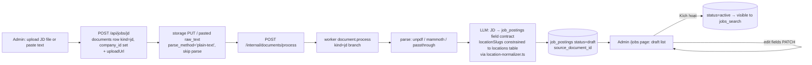

# Feature 2 — JD upload → job breakdown (draft → human review → activate)

Depends on: [00-foundation](00-foundation.md) (documents + queue + parse step from [01](01-cv-to-profile.md) step 3).

## Goal

Upload a client's job-description document (or paste text) → same parse pipeline as CVs → LLM breaks it into structured `job_postings` fields linked to the client company → saved as **draft**, invisible to the agent until an admin reviews and activates it.

## DB schema — migration `11_job_posting_status.sql`

```sql
alter table public.job_postings
  add column if not exists status text not null default 'active'
    check (status in ('draft', 'active', 'archived')),
  add column if not exists source_document_id uuid references public.documents(id) on delete set null;

update public.job_postings set status = 'archived' where is_active = false;

drop index if exists job_postings_tenant_idx;
create index if not exists job_postings_tenant_status_idx
  on public.job_postings (tenant_id, status, created_at desc);

alter table public.job_postings drop column if exists is_active;
```

**Dropping `is_active` — call sites to update in the SAME PR** (follows the 08_companies drop-superseded-column precedent):

| File | Change |
|---|---|
| `packages/database/src/repositories.ts` | `listActive`/`count`: `where status = 'active'`; `bulkInsert`: `is_active = true` → `status = 'active'` |
| `services/worker/scripts/twenty/parse-jobs-to-sql.ts` | emit `status` column instead of `is_active` (lines ~137, ~170) |
| `jobs_insert.sql` (repo root seed data) | regenerate via the script above, or sed `is_active`→`status`, `true`→`'active'` |
| `apps/admin/src/lib/types.ts:48` | check whether this `is_active` is the job type or prompt-template type; update if job |

(`03_seed.sql`, `PromptsManager.tsx`, `page.tsx` matches are `prompt_templates.is_active` — untouched.)

## Repository additions — `createJobPostingRepository`

```ts
findByIdOrExternalId(input: { tenantId; idOrExternalId }): Promise<JobPostingRow | null>  // also needed by feature 6
createDraft(input: { tenantId; sourceDocumentId; fields: JdExtractedFields }): Promise<JobPostingRow>  // status='draft'
updateFields(input: { id; patch: Partial<JdExtractedFields> }): Promise<JobPostingRow>
setStatus(input: { id; status: "draft" | "active" | "archived" }): Promise<void>
listByStatus(input: { tenantId; status; limit? }): Promise<JobPostingRow[]>
```

## Pipeline



JD extraction output contract (zod-validated): `{ title, requiredSkills[], salaryMinVnd?, salaryMaxVnd?, locationSlugs[] (from locations.slug: ho-chi-minh-city|ha-noi|da-nang|remote), workMode?, seniority?, jobType?, experienceRequiredYears?, benefits?, educationRequired?, description }`. No chat message is sent for JD processing — result is admin-visible only.

## Files to create / modify

| File | Change |
|---|---|
| `packages/agent/src/core/document-processor.ts` | add kind=jd branch (extraction prompt + `location-normalizer` slug mapping + `jobs.createDraft`) |
| `apps/admin/src/app/api/jobs/jd/route.ts` | new: `{companyId, fileName?, mimeType?, pastedText?}` → documents row + uploadUrl (or immediate process for paste) |
| `apps/admin/src/app/api/jobs/route.ts` | new: `GET ?status=` via `listByStatus` |
| `apps/admin/src/app/api/jobs/[id]/route.ts` | new: `PATCH` field patch via `updateFields` |
| `apps/admin/src/app/api/jobs/[id]/activate/route.ts` | new: `POST` → `setStatus('active')` |
| `apps/admin/src/app/jobs/page.tsx` | new page: drafts table + all postings; row → edit form + "Kích hoạt" button (direct-to-Neon like other admin routes) |

Drafts are automatically invisible to the agent — `listActive` filters `status='active'`; no agent change needed.

## Step-by-step

1. Migration 11 **+ all `is_active` call-site updates in one PR** → migrate branch DB, then dev.
   - **Verify:** `pnpm --filter @platform/database test`; `hr-chat.ts` — "tìm việc React" still returns jobs (proves listActive works); `select status, count(*) from job_postings group by 1` shows sensible split.
2. New jobs repo functions + unit tests (draft not returned by listActive; activate flips visibility).
   - **Verify:** repo tests green.
3. JD branch in document-processor: prompt + slug normalization + `createDraft`.
   - **Verify:** seed a JD document (fixture text), enqueue via internal endpoint → draft row with parsed fields; `location_slugs` only contains valid slugs; job absent from `jobs_search` results.
4. Admin routes + `/jobs` page.
   - **Verify (E2E):** upload a real Vietnamese JD PDF against a seeded company → draft appears on /jobs → edit salary → activate → ask the chat agent for that role and see the new job recommended. Paste-text path: same, skipping upload.

## Risks

- JD formats vary wildly; the draft-review gate is the safety net — extraction only has to be *approximately* right.
- Salary units: prompt must normalize "$1,500", "25 triệu", "25tr" → VND (reuse the USD→VND conversion convention from `gather-requirement`).
- `updateFields` must not allow editing an activated posting's `status` implicitly — status changes only via `setStatus`.
