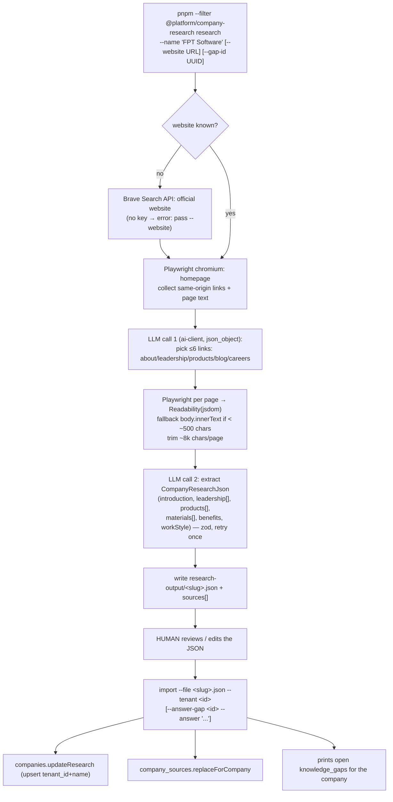

# Feature 3 — Company research CLI + Feature 3.1 — Knowledge-gap capture

Independent of features 1/2/4/5 (only needs the existing `companies` table). User decision: **local CLI in the repo** (Node + Playwright + existing `ai-client`), separate import command; schema must not preclude a SaaS crawl API later.

## Goal

Given a company name/website: browse the site + search, extract introduction, leadership ("who leads"), products, content/materials/books → structured JSON the operator reviews → import into Neon → `jobs_queryCompany` answers richer questions. When the agent *can't* answer a company/job question, it records the gap (3.1), and the CLI consumes open gaps as research targets.

## DB schema

### Migration `13_company_research.sql`

```sql
alter table public.companies add column if not exists website text;
alter table public.companies add column if not exists leadership jsonb not null default '[]'::jsonb;
-- [{ "name": "...", "title": "CEO", "bio": "...", "source_url": "..." }]
alter table public.companies add column if not exists products jsonb not null default '[]'::jsonb;
-- [{ "name": "...", "description": "...", "url": "..." }]
alter table public.companies add column if not exists materials jsonb not null default '[]'::jsonb;
-- [{ "type": "book|blog|video|press|other", "title": "...", "url": "...", "description": "..." }]
alter table public.companies add column if not exists research jsonb not null default '{}'::jsonb;
-- freeform: crawl stats, model used, operator notes
alter table public.companies add column if not exists researched_at timestamptz;

create table if not exists public.company_sources (
  id uuid primary key default gen_random_uuid(),
  tenant_id uuid not null references public.tenants(id) on delete cascade,
  company_id uuid not null references public.companies(id) on delete cascade,
  url text not null,
  kind text not null default 'other'
    check (kind in ('homepage','about','leadership','products','blog','careers','search_result','other')),
  title text,
  content_excerpt text,
  fetched_at timestamptz,
  created_at timestamptz not null default now(),
  constraint company_sources_company_url_key unique (company_id, url)
);

create index if not exists company_sources_tenant_company_idx
  on public.company_sources (tenant_id, company_id);
```

### Migration `14_knowledge_gaps.sql`

```sql
create table if not exists public.knowledge_gaps (
  id uuid primary key default gen_random_uuid(),
  tenant_id uuid not null references public.tenants(id) on delete cascade,
  conversation_id uuid references public.conversations(id) on delete set null,
  company_id uuid references public.companies(id) on delete set null,
  question text not null,
  topic text not null default 'other'
    check (topic in ('company','job','process','benefits','other')),
  status text not null default 'open'
    check (status in ('open','researching','answered','dismissed')),
  answer text,
  ask_count int not null default 1,
  last_asked_at timestamptz not null default now(),
  answered_at timestamptz,
  created_at timestamptz not null default now()
);

create index if not exists knowledge_gaps_tenant_status_idx
  on public.knowledge_gaps (tenant_id, status, last_asked_at desc);
create index if not exists knowledge_gaps_company_idx
  on public.knowledge_gaps (company_id) where company_id is not null;
```

Dedup is repo-side (same tenant + `company_id IS NOT DISTINCT FROM $2` + `lower(question)` → increment `ask_count`), not a partial unique index — nullable company_id makes unique constraints awkward and write rate is tiny.

## Repositories

```ts
// createCompanyRepository — extended (CompanyRow gains the new columns)
listByTenant(input: { tenantId }): Promise<CompanyRow[]>
updateResearch(input: { tenantId; name;                       // upsert key (tenant_id, name)
  website?; introduction?; benefits?; workStyle?;
  leadership?: unknown[]; products?: unknown[]; materials?: unknown[];
  research?: Record<string, unknown> }): Promise<CompanyRow>  // ... , researched_at = now()

// NEW createCompanySourceRepository
replaceForCompany(input: { tenantId; companyId; sources: Array<{url; kind; title?; contentExcerpt?; fetchedAt?}> }): Promise<{inserted: number}>
listByCompany(input: { tenantId; companyId }): Promise<CompanySourceRow[]>

// NEW createKnowledgeGapRepository
record(input: { tenantId; conversationId?; companyId?; question; topic? }): Promise<{ id; duplicate: boolean }>
listOpen(input: { tenantId; companyId?; limit? }): Promise<KnowledgeGapRow[]>
markAnswered(input: { id; answer }): Promise<void>
updateStatus(input: { id; status: "researching" | "dismissed" }): Promise<void>
```

## CLI architecture — `packages/company-research`

New workspace package (`pnpm-workspace.yaml` globs already cover `packages/*`; no `tools/` dir exists).

**Scripted crawl with two narrow LLM calls — NOT an LLM-driven browser agent loop.** An agent loop is ~10× tokens, slow, non-deterministic; the only adaptivity needed is "which links look like About/Team/Products", which one cheap LLM call over the homepage's link list handles.

```
packages/company-research/
  package.json          # playwright, @mozilla/readability, jsdom, zod,
                        # @platform/ai-client, @platform/database, dotenv
  src/
    cli.ts              # subcommands: research | import | gaps (argv parsing per agent/src/cli/args.ts)
    research.ts         # orchestrates crawl → extract → JSON file
    crawl.ts            # Playwright: load page, collect same-origin links, readable text
    extract.ts          # LLM: pickRelevantLinks(), extractCompanyProfile() (zod-validated)
    schema.ts           # CompanyResearchJson zod schema (shared by research + import)
    import.ts           # JSON → companies.updateResearch + companySources.replaceForCompany
  research-output/      # gitignored JSON drafts
```



`gaps` subcommand lists open gaps (question, ask_count, company) as research targets. Anti-bot escape hatch: `--manual-text file.txt` skips crawling and extracts from pasted text.

### Library choices

| Concern | Pick | Rejected | Why |
|---|---|---|---|
| Browser | **Playwright** | puppeteer (no advantage), fetch+cheerio (fails on client-rendered sites — common for VN companies) | auto-wait, bundled chromium, first-class TS |
| Text extraction | **@mozilla/readability + jsdom**, fallback `body.innerText` (<500 chars) | turndown (noisy on marketing pages), trafilatura (Python) | battle-tested boilerplate removal on rendered HTML |
| Search discovery | **Brave Search API** (free ~2k/mo, optional `BRAVE_SEARCH_API_KEY`) | DDG scraping (ToS-gray, brittle), SerpAPI (paid), Google CSE (ceremony) | graceful degrade: no key ⇒ `--website` required |
| LLM | **existing `@platform/ai-client`** (`responseFormat: json_object`) | new SDK | zero new AI deps; zod-validate, retry once |

## Feature 3.1 — `record-knowledge-gap` skill

- Dir: `packages/agent/src/skills/record-knowledge-gap/{handler.ts,SKILL.md}`; tool `knowledge_recordGap`.
- Zod params: `{ question: z.string(), companyName: z.string().optional(), topic: z.enum([...]).optional() }`.
- Ctx: `RecordKnowledgeGapContext { recordGap?: (input) => Promise<{ id; duplicate }> }`; mock fallback `{ id: "mock-gap", duplicate: false }`.
- Runner: `gapsRepoSingleton` (lazy, like `getCompanyRepo()`); resolves `companyName → company_id` via `companies.findByName`; `conversationId` = scenario id (worker passes conversation id as scenario id — `main.ts:546`).
- SKILL.md contract: *call when the candidate asks a factual question about a company/job/process that `jobs_queryCompany`/`jobs_search` cannot answer (missing or empty data). Never fabricate. After recording, tell the candidate (Vietnamese) the question is noted and the team will follow up. Not for opinions or already-answered questions.*

## `query-company` skill changes

- `CompanyDetail` + handler pass through `website`, `leadership`, `products`, `materials`, `researchedAt`; runner `getCompany` mapping (runner.ts:158-171) maps the new columns.
- SKILL.md: output now covers "who leads the company", products, materials/books/links; adds *"if a requested field is empty or researchedAt is null, answer with what exists and call `knowledge_recordGap`"*.

## Step-by-step

**3.1 first (agent side), then the CLI.**

1. Migration 14 → `createKnowledgeGapRepository` + repo set; unit test dedup/increment (same question twice → ask_count 2, duplicate:true).
   - **Verify:** `pnpm --filter @platform/database test`.
2. `record-knowledge-gap` skill + registry + runner wiring + `query-company` SKILL.md update; regenerate `skills-content.ts`.
   - **Verify:** `hr-chat.ts`: ask about an unresearched company's CEO → agent answers honestly + gap row inserted (`select question, ask_count from knowledge_gaps`); `tool_call_audits` shows the call.
3. Migration 13 → companies repo extensions + `createCompanySourceRepository`; unit tests (upsert updates researched_at; replaceForCompany idempotent).
4. Scaffold `packages/company-research`; `crawl.ts` with 2 fixture HTML files (vitest, no network); `extract.ts` + `schema.ts` with canned-LLM-JSON fixtures.
   - **Verify:** `pnpm --filter @platform/company-research test`.
5. `research` command end-to-end on one real company (e.g. a seeded company with a public site).
   - **Verify:** JSON file has plausible introduction/leadership/products; sources list the visited URLs; total LLM cost ≈ 2 calls.
6. `import` + `gaps` commands.
   - **Verify:** import twice → idempotent (same row, updated researched_at); `hr-chat.ts`: "ai là CEO của <company>?" now answered from DB; `import --answer-gap` flips the gap from step 2 to answered.

## Risks

- **Anti-bot**: Cloudflare-protected sites fail headless → `--manual-text` escape hatch; acceptable for a supervised local tool.
- **Neon max:1 pool**: import writes a handful of rows sequentially — fine.
- LLM extraction quality varies with site structure; the human-review step before import is the quality gate.
- `zca-js`-style ToS concerns don't apply (public websites, low volume, local operator-driven).
