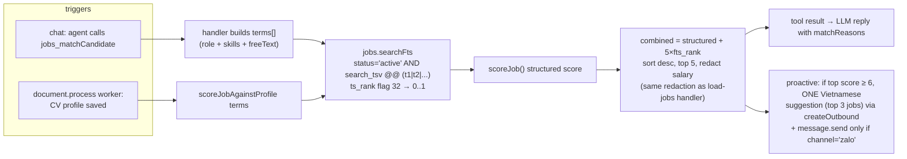

# Feature 4 — Job-fit matching (hybrid FTS + structured scoring, pgvector-ready)

Depends on: migration 11 (`status` column). Proactive trigger depends on feature 1 (profile after CV parse). English-first FTS per user decision.

## Goal

Candidate profile + chat requirements → ranked best-fit jobs, on demand in chat (`jobs_matchCandidate` tool) and proactively after CV processing. Full-text relevance (`ts_rank`) is **additive recall** on top of the existing structured scorer — not the sole gate. Schema ready for an embedding rerank later.

## DB schema — migration `15_job_search_fts.sql`

```sql
-- weighted FTS over job_postings; 'english' config = stemming ("developing" matches "developer").
-- f_array_to_string immutable wrapper created in 09_documents.sql.
alter table public.job_postings add column if not exists search_tsv tsvector
  generated always as (
    setweight(to_tsvector('english', coalesce(title, '')), 'A') ||
    setweight(to_tsvector('english', coalesce(public.f_array_to_string(required_skills, ' '), '')), 'B') ||
    setweight(to_tsvector('english', coalesce(seniority, '') || ' ' || coalesce(job_type, '')), 'C') ||
    setweight(to_tsvector('english', coalesce(description, '')), 'D')
  ) stored;

create index if not exists job_postings_search_tsv_idx
  on public.job_postings using gin (search_tsv);

-- pgvector-ready (locked decision): nullable, NO index until an embeddings key is chosen.
alter table public.job_postings add column if not exists embedding vector(1536);
```

No unaccent, no Vietnamese handling — English-first. If Vietnamese free-text recall is needed later, add a `'simple'`-config shadow column (additive migration).

## Repository — `createJobPostingRepository.searchFts`

```ts
searchFts(input: { tenantId: string; terms: string[]; limit?: number }):
  Promise<Array<JobPostingRow & { fts_rank: number }>>
```

```sql
-- query built app-side: terms → plainto_tsquery('english', t) joined with ' | '
select jp.*, c.name as company, c.introduction as company_introduction, ...,
       ts_rank(jp.search_tsv, q.query, 32) as fts_rank   -- flag 32 → rank/(rank+1), bounded 0..1
from job_postings jp
left join companies c on c.id = jp.company_id
cross join (select $2::tsquery as query) q
where jp.tenant_id = $1
  and jp.status = 'active'          -- post-migration-11 (NOT is_active)
  and jp.search_tsv @@ q.query
order by fts_rank desc
limit $3
```

## Score combination — where each piece lives

| Piece | Location | Note |
|---|---|---|
| FTS candidate set + `ts_rank` | `jobs.searchFts` (SQL) | recall |
| Structured score (role/location/workMode/salary/skills) | `packages/agent/src/core/location-normalizer.ts` — existing `scoreJob` / `scoreJobAgainstProfile` | single source of truth, unchanged |
| Combination + sort + redaction | new tool handler | `combined = structured + 5 * fts_rank` (weight ≈ one strong structured signal; tune against real data) |

## Flow



## New agent skill — `match-candidate`

- Dir: `packages/agent/src/skills/match-candidate/{handler.ts,SKILL.md}`; tool `jobs_matchCandidate`.
- Zod params: `{ role?, skills?: string[], locations?: string[], workMode?, salaryMinVnd?, freeText? }`.
- Ctx: `MatchCandidateContext { matchJobs?: (input: { terms: string[]; filters: JobMatchFilters; limit? }) => Promise<Array<JobPosting & { ftsRank: number }>> }`. Runner wires via existing `jobsRepoSingleton` + `jobRowToPosting` (+ `ftsRank: Number(row.fts_rank)`).
- Mock fallback: `scoreJob` over mockJobs with `ftsRank: 0` — testable without DB.
- **Salary redaction identical to `load-jobs/handler.ts:42`** — never expose salary figures.
- SKILL.md: use when the candidate's profile/requirements are substantially known and they want recommendations ("việc nào hợp với mình?"); distinct from `jobs_search` (filter-driven browse) — this is best-fit ranking; output includes `matchReasons`.
- `load-jobs` SKILL.md gains one line: "for 'which jobs fit me' with a known profile, prefer `jobs_matchCandidate`". Handler untouched.

## Proactive trigger (in document-processor CV branch)

After profile upsert: build terms from the fresh profile (`scoreJobAgainstProfile`), run the same match, and if the top combined score ≥ 6, compose one Vietnamese message with the top 3 jobs → `createOutbound` + channel-gated `message.send`. One suggestion per CV upload; no cron.

## Embedding upgrade path (sketch only — NOT built now)

1. Choose an embeddings key (OpenAI or Gemini — OpenRouter has no embeddings endpoint); `workflow_configs.embedding_model` already exists (`text-embedding-3-small`, 1536 dims).
2. Migration: `create index ... using hnsw (embedding vector_cosine_ops)` on job_postings + candidate_profiles.
3. Worker consumes `knowledge.embed` jobs `{kind: 'job_posting'|'candidate_profile', id}`; backfill script enqueues all rows.
4. Matching adds a rerank: FTS+structured top 50 → blend `1 - (embedding <=> candidateEmbedding)` into combined score.

## Step-by-step

1. Migration 15 → branch DB, then dev.
   - **Verify:** `select title, ts_rank(search_tsv, plainto_tsquery('english','react developer'), 32) from job_postings where search_tsv @@ plainto_tsquery('english','react developer')` returns ranked rows; a job titled "Senior React Development Engineer" matches the query "developer" (stemming).
2. `jobs.searchFts` + `fts_rank` on the row type. Test: SQL/params assertion + integration against seeded jobs.
   - **Verify:** `pnpm --filter @platform/database test`.
3. `match-candidate` skill: term-building, combination math, salary redaction, mock fallback — unit tests (pattern: `registry.test.ts`).
   - **Verify:** `pnpm --filter @platform/agent test`.
4. Registry + runner wiring; `load-jobs` SKILL.md pointer; regenerate `skills-content.ts`.
   - **Verify:** `hr-chat.ts`: "việc nào hợp với tôi, tôi biết React và Node" → tool called (see `tool_call_audits`), top-5 reply with reasons, no salary figures.
5. Proactive suggestion in document-processor.
   - **Verify:** upload a CV with strong skill overlap to seeded jobs → after the profile-summary message, a second suggestion message with top 3 jobs appears; upload a CV with no overlap → no suggestion (threshold works).

## Risks

- OR-ing many profile terms rewards long descriptions; flag 32 bounds it, but tune the `5×` weight on real data before trusting proactive sends.
- English-only FTS: Vietnamese free-text queries won't match well — accepted trade-off; structured filters still work for Vietnamese input because `gather-requirement` normalizes to slugs/enums.
- Generated column rebuilds the tsvector on every job update — negligible at current scale.
