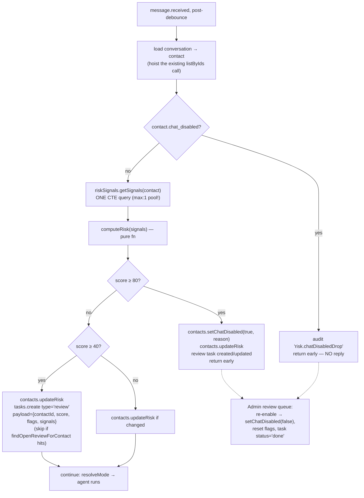

# Feature 5 — Crawler / fraud detection (flag + human review, hard-threshold disable)

Depends on: feature 1's DB-backed profile write path (for change logging). User decision: flag + human review via existing `human_tasks`; auto-disable only above a hard threshold; disabled contacts are **silently dropped** (replying teaches scrapers where the threshold is).

## Goal

Detect scraping (many job queries, no profile progress, bulk requests) and identity churn (name/tech-stack flip-flopping). Score explainably in the worker before the agent runs; ≥40 flags for admin review, ≥80 disables chat. Guests resolve to contacts (`guest_access.contact_id`), so one enforcement point covers both channels.

## DB schema — migration `16_risk_detection.sql`

```sql
alter table public.contacts add column if not exists risk_score int not null default 0;
alter table public.contacts add column if not exists risk_flags jsonb not null default '[]'::jsonb;
alter table public.contacts add column if not exists chat_disabled boolean not null default false;
alter table public.contacts add column if not exists chat_disabled_reason text;
alter table public.contacts add column if not exists risk_updated_at timestamptz;

-- Explicit change log: tool_call_audits only sees agent-tool updates; CV parsing and
-- admin edits also change profiles, and churn detection needs all three sources.
create table if not exists public.profile_change_log (
  id uuid primary key default gen_random_uuid(),
  tenant_id uuid not null references public.tenants(id) on delete cascade,
  contact_id uuid not null references public.contacts(id) on delete cascade,
  field text not null,           -- 'display_name' | 'skills' | 'current_title' | ...
  old_value jsonb,
  new_value jsonb,
  source text not null default 'chat' check (source in ('chat','cv','admin')),
  created_at timestamptz not null default now()
);

create index if not exists profile_change_log_contact_idx
  on public.profile_change_log (tenant_id, contact_id, field, created_at desc);

-- Speeds up risk counters over audits (join path: audits → conversations → contact).
create index if not exists tool_call_audits_conv_tool_time_idx
  on public.tool_call_audits (conversation_id, tool_name, created_at desc);

-- human_tasks gains a 'review' type.
-- NOTE: verify the actual constraint name on the live DB first (\d human_tasks);
-- inline checks are auto-named <table>_<col>_check.
alter table public.human_tasks drop constraint if exists human_tasks_type_check;
alter table public.human_tasks
  add constraint human_tasks_type_check check (type in ('approval','handoff','review'));
```

## Heuristics — pure function in `services/worker/src/risk.ts`

```ts
export interface RiskSignals {
  inbound_messages_1h: number;
  job_tool_calls_24h: number;      // jobs_search, jobs_getJobFilters, jobs_matchCandidate
  profile_tool_calls_24h: number;  // crm_updateCandidateProfile etc. → "profile progress" proxy
  name_changes_7d: number;         // profile_change_log field='display_name'
  skills_changes_7d: number;       // profile_change_log field='skills'
}
export function computeRisk(s: RiskSignals): { score: number; flags: string[] }
```

Additive, explainable, 0–100:

| Signal | Condition | Points | Flag |
|---|---|---|---|
| Message flood | `inbound_messages_1h > 30` | +15 | `high_message_rate` |
| Job scraping | `job_tool_calls_24h > 20` | +25 | `high_job_query_rate` |
| No profile progress | `job_tool_calls_24h > 10 && profile_tool_calls_24h === 0` | +20 | `scrape_no_profile` |
| Name churn | `name_changes_7d >= 3` | +25 | `identity_churn_name` |
| Skills churn | `skills_changes_7d >= 3` | +20 | `identity_churn_skills` |

Thresholds: **≥40** → persist score/flags + one open `human_tasks` review (deduped), chat continues. **≥80** → `chat_disabled=true` + reason, review task, agent never runs.

## Decision flow (worker `message.received`, after debounce, before `resolveMode`)



## Repositories

```ts
// createContactRepository — extended (ContactRow gains the 5 risk columns)
findById(id): Promise<ContactRow | null>          // shared with feature 1
updateRisk(input: { contactId; riskScore; riskFlags: string[] }): Promise<void>
setChatDisabled(input: { contactId; disabled; reason?: string | null }): Promise<void>

// NEW createProfileChangeLogRepository
append(input: { tenantId; contactId; field; oldValue?; newValue?; source? }): Promise<void>
countChanges(input: { tenantId; contactId; field; sinceHours }): Promise<number>

// NEW createRiskSignalRepository — ONE round trip via CTEs (critical on max:1 pool)
getSignals(input: { tenantId; contactId }): Promise<RiskSignals>

// createHumanTaskRepository — extended
create: type union widened to "approval" | "handoff" | "review"
findOpenReviewForContact(input: { tenantId; contactId }): Promise<HumanTaskRow | null>
  // WHERE type='review' AND status='open' AND payload->>'contactId' = $2
updateStatus(input: { id; status }): Promise<void>
```

`getSignals` CTE sketch: one query with five sub-counts — messages joined via conversations (1h window), tool_call_audits joined via conversations filtered by tool_name lists (24h), profile_change_log by field (7d).

## Change-log hooks (where `profileChanges.append` gets called)

| Write path | File | Source tag |
|---|---|---|
| Agent tool `crm_updateCandidateProfile` (DB-backed ctx from feature 1) | runner ctx callback | `chat` |
| CV parse profile upsert | `document-processor.ts` | `cv` |
| Admin profile edits | admin route(s) | `admin` |

Only fields whose value actually changed get a row (compare before write). `display_name` changes on `contacts` also log here.

## Admin UI

- Review queue: list `human_tasks` `type='review'` open items with payload (score, flags, signals) — fast triage.
- Re-enable action: server action / route calling `contacts.setChatDisabled({disabled:false})` + reset `risk_flags` + `tasks.updateStatus('done')`. Direct-to-Neon, no API service change.

## Step-by-step

1. Migration 16 (verify `human_tasks` constraint name on live DB first) → branch DB, then dev.
   - **Verify:** `\d contacts` shows risk columns; inserting a `type='review'` human_task succeeds.
2. Repo work: contacts risk fns, `profileChanges`, `riskSignals.getSignals` single-CTE, tasks extensions. Unit tests incl. the CTE returning zeros for a fresh contact.
   - **Verify:** `pnpm --filter @platform/database test`.
3. `risk.ts` pure `computeRisk` — exhaustive table tests: each flag fires alone, combinations sum, boundaries 39/40/79/80.
   - **Verify:** `pnpm --filter @platform/worker test`.
4. Worker integration: chat_disabled early-return + scoring branch before `resolveMode`; audit row on drop.
   - **Verify (manual):** in a test conversation, hammer `jobs_search` >20 times in 24h (script the admin simulator) → review task appears with `high_job_query_rate`; force score ≥80 (lower thresholds via env for the test or seed profile_change_log rows) → replies stop, `tool_call_audits` shows `risk.chatDisabledDrop`.
5. Change-log hooks in the three write paths.
   - **Verify:** update profile via chat 3× with different names → `select count(*) from profile_change_log where field='display_name'` = 3 → next message flags `identity_churn_name`.
6. Admin review queue + re-enable.
   - **Verify:** re-enable a disabled contact → next message gets a normal agent reply; task shows `done`.

## Risks

- **False-positive ghosting**: a legit user at ≥80 is silently dropped until review — review payload includes raw signals for fast triage; consider an SLA note in the admin UI.
- Signals query must stay one CTE round trip; the 10s debounce already caps per-conversation frequency.
- Thresholds are guesses — make them env-tunable (`RISK_FLAG_THRESHOLD`, `RISK_DISABLE_THRESHOLD`) so tuning needs no deploy.
- Coordination: the `chat` hook lands inside feature 1's ctx callback — if feature 5 ships first, churn signals stay at 0 until then (degrades gracefully).
