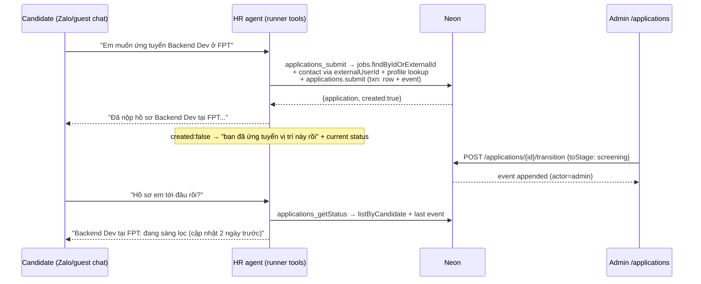

# Feature 6 — Application tracking (submit via chat, pipeline progress, status skill)

Depends on: migrations 10 (candidate_profiles FK) and 11 (status filter, `findByIdOrExternalId`). Independent of features 3/4/5.

## Goal

Candidate applies to a job in chat → durable `applications` record → admin moves it through pipeline stages → candidate asks "hồ sơ em tới đâu rồi?" and the agent reports real status with history.

## Data model rationale

The taxonomy "submitted → screening → interviewing → offer → hired/rejected/withdrawn" mixes **positions** with **outcomes**. Split them:

- `stage` = furthest pipeline position reached (`submitted → screening → interviewing → offer`), forward-only.
- `status` = outcome (`active → hired | rejected | withdrawn`), terminal once set.

"Rejected at the interviewing stage" stays representable; "all active applications" is a one-column filter. Every transition is an append-only `application_events` row with an actor.

## DB schema — migration `12_applications.sql`

```sql
create table if not exists public.applications (
  id                    uuid primary key default gen_random_uuid(),
  tenant_id             uuid not null references public.tenants(id) on delete cascade,
  job_posting_id        uuid not null references public.job_postings(id) on delete cascade,
  contact_id            uuid references public.contacts(id) on delete cascade,
  guest_access_id       uuid references public.guest_access(id) on delete cascade,
  candidate_profile_id  uuid references public.candidate_profiles(id) on delete set null,
  stage                 text not null default 'submitted'
                        check (stage in ('submitted', 'screening', 'interviewing', 'offer')),
  status                text not null default 'active'
                        check (status in ('active', 'hired', 'rejected', 'withdrawn')),
  applied_via           text not null default 'chat' check (applied_via in ('chat', 'admin')),
  note                  text,
  created_at            timestamptz not null default now(),
  updated_at            timestamptz not null default now(),
  constraint applications_owner_check
    check (contact_id is not null or guest_access_id is not null)
);

-- idempotent submits: one application per owner per job
create unique index if not exists applications_tenant_job_contact_key
  on public.applications (tenant_id, job_posting_id, contact_id) where contact_id is not null;
create unique index if not exists applications_tenant_job_guest_key
  on public.applications (tenant_id, job_posting_id, guest_access_id) where guest_access_id is not null;
create index if not exists applications_tenant_contact_idx
  on public.applications (tenant_id, contact_id, created_at desc);
create index if not exists applications_tenant_stage_idx
  on public.applications (tenant_id, status, stage, updated_at desc);

create table if not exists public.application_events (
  id              uuid primary key default gen_random_uuid(),
  tenant_id       uuid not null references public.tenants(id) on delete cascade,
  application_id  uuid not null references public.applications(id) on delete cascade,
  from_stage      text,
  to_stage        text not null,
  from_status     text,
  to_status       text not null,
  actor_type      text not null check (actor_type in ('agent', 'admin', 'candidate', 'system')),
  actor_id        text,          -- admin user id / 'hr-agent' / external user id
  note            text,
  created_at      timestamptz not null default now()
);

create index if not exists application_events_application_idx
  on public.application_events (application_id, created_at asc);
```

## Repository — `createApplicationRepository(client)`

```ts
// Idempotent: ON CONFLICT (partial unique) → returns existing row, created=false.
// Inserts the initial application_events row in the SAME transaction:
// pool.connect() + BEGIN/COMMIT (migrator.ts pattern) — required on the max:1 pool.
submit(input: { tenantId; jobPostingId; contactId?; guestAccessId?; candidateProfileId?;
  appliedVia: "chat" | "admin"; actorType; actorId?; note? }): Promise<{ application: ApplicationRow; created: boolean }>

findById(id): Promise<ApplicationRow | null>
// joins job_postings + companies: "Frontend Dev tại FPT — đang phỏng vấn"
listByCandidate(input: { tenantId; contactId?; guestAccessId? }):
  Promise<Array<ApplicationRow & { job_title: string; company_name: string }>>
listByTenant(input: { tenantId; status?; stage?; limit? }):
  Promise<Array<ApplicationRow & { job_title; company_name; candidate_name: string | null }>>

// Validates: stage forward-only (submitted→screening→interviewing→offer),
// status only from 'active', no edits once status != 'active'. Appends event transactionally.
transition(input: { applicationId; toStage?; toStatus?; actorType; actorId?; note? }): Promise<ApplicationRow>
listEvents(applicationId): Promise<ApplicationEventRow[]>
```

## Flow



## New agent skills

Both follow the `createQueryCompanyTool(ctx)` pattern: handler + SKILL.md + mock fallback; regenerate `skills-content.ts` after.

| Skill dir | Tool | Zod params | Ctx callback |
|---|---|---|---|
| `packages/agent/src/skills/submit-application/` | `applications_submit` | `{ jobId: z.string(), note: z.string().optional() }` | `submit({jobId, note?}) → {applicationId, created, jobTitle, companyName}` |
| `packages/agent/src/skills/get-application-status/` | `applications_getStatus` | `{}` | `getStatus() → Array<{jobTitle, companyName, stage, status, updatedAt, lastNote}>` |

Tenant/channel/externalUserId are **closed over in the ctx** (not LLM-passed — unlike the legacy crm_* signatures). `jobId` resolves via `findByIdOrExternalId` because `jobRowToPosting` exposes `external_id ?? id` to the LLM. Owner resolution contact-first (guests hold a `contact_id` after claim).

SKILL.md contracts:
- `submit-application`: call only after the candidate clearly confirms they want to apply to a **specific** job surfaced in this conversation; on `created:false`, tell them they already applied and report current status; never invent job ids.
- `get-application-status`: call when the candidate asks about progress of submitted applications; report each as job title + company + stage/status in Vietnamese, mention last update time; if none, offer to search jobs.

Registry: extend `AgentToolsContext` with `applications?: ApplicationsContext`; runner adds `getApplicationsRepo()` singleton.

## Admin UI (minimal)

| File | Change |
|---|---|
| `apps/admin/src/app/api/applications/route.ts` | `GET ?status=&stage=` → `listByTenant` |
| `apps/admin/src/app/api/applications/[id]/transition/route.ts` | `POST {toStage?|toStatus?, note?}` → `transition` (actor `admin`) |
| `apps/admin/src/app/api/applications/[id]/events/route.ts` | `GET` → `listEvents` |
| `apps/admin/src/app/applications/page.tsx` | list grouped by stage; dropdown to advance stage / set outcome; event-history drawer |

## Step-by-step

1. Migration 12 → branch DB, then dev.
   - **Verify:** `\d applications`; inserting two rows for same (tenant, job, contact) fails on the unique index.
2. `createApplicationRepository` + repo set. Tests: idempotent double-submit (created=false), illegal transitions rejected (offer→screening, transition after rejected), events appended with correct from/to, txn rollback on event-insert failure.
   - **Verify:** `pnpm --filter @platform/database test`.
3. Skills + `jobs.findByIdOrExternalId` + registry/runner wiring; regenerate skills-content; `registry.test.ts` cases (mock fallback works; ctx path calls callbacks with resolved ids).
   - **Verify:** `hr-chat.ts` full loop — "tìm việc React" → "ứng tuyển job đầu tiên" → confirm → re-ask "hồ sơ tới đâu rồi"; check `applications`, `application_events`, `tool_call_audits` rows. Re-apply → agent says already applied.
4. Admin endpoints + `/applications` page.
   - **Verify (cross-channel E2E):** submit via chat → admin moves to `interviewing` with a note → chat asks status → reply reflects the new stage and note timing.

## Risks / deferred

- Re-applying after `rejected`/`withdrawn` is blocked by the unique index in phase 1; the tool reports the prior outcome. Product decision deferred (options: reopen event vs archive+new row).
- `transition` allows stage skips forward (submitted→interviewing) intentionally — real pipelines skip steps; only *backward* moves are rejected.
- Guest→Zalo identity merge (same person, two contacts) is out of scope; applications follow the contact.
