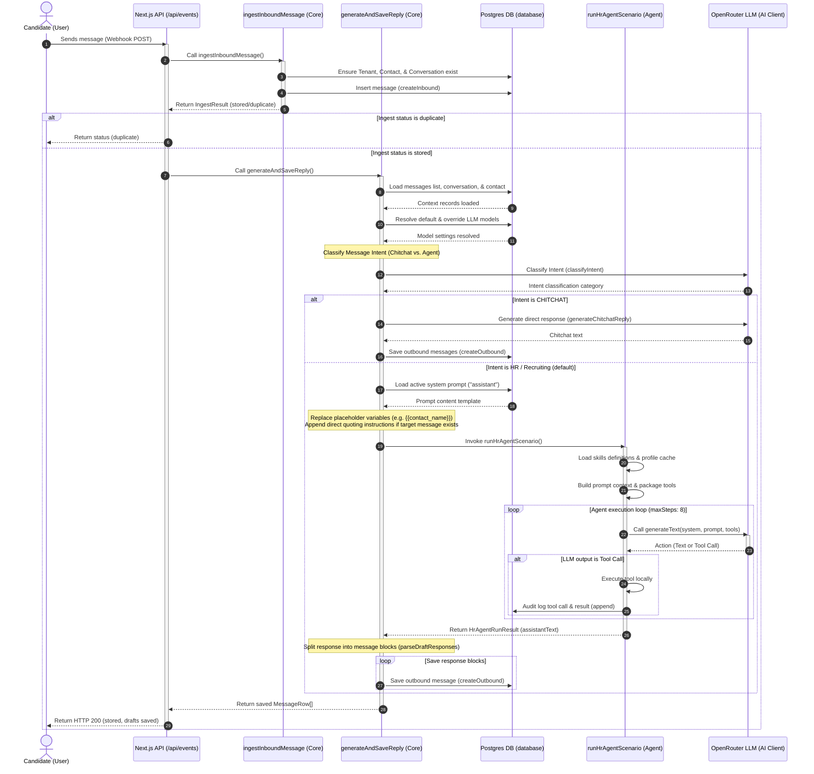
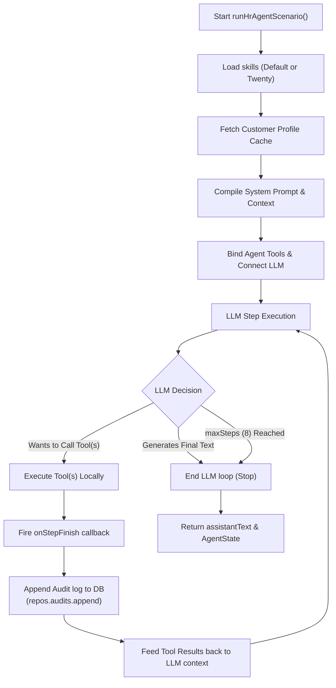

# User Reply Processing Flow Diagram

This document details the lifecycle of an inbound user reply, tracing it from webhook ingestion, intent classification, prompt and context loading, to the LLM agent execution loop and final response persistence.

---

## 1. End-to-End Sequence Diagram

The following sequence diagram outlines the entire control flow across components when a message is ingested at `/api/events`.

---

## 2. Agent Execution and Tool-Calling Loop

When running the agent scenario (`runHrAgentScenario`), the Vercel AI SDK's `generateText` method executes a loop of tool-calling steps (up to 8 times). Each step details audit logging on completion.

---

## 3. Detailed Component Breakdown

### 1. Ingestion Layer
* **Entry Point**: [api/events/route.ts](file:///Users/phuc.dang/repos/twenty/apps/admin/src/app/api/events/route.ts#L8) handles the incoming webhook post.
* **Database Mirroring**: [ingestInboundMessage](file:///Users/phuc.dang/repos/twenty/packages/core/src/ingest.ts#L30) checks the existence of required tenant, contact, and conversation containers, creating them on-demand.
* **Idempotency Protection**: A unique constraint on the database message table intercepts duplicate webhooks (returning `status: "duplicate"`).

### 2. Intent Classification
* **Classifier**: [classifyIntent](file:///Users/phuc.dang/repos/twenty/packages/agent/src/verticals/hr/intent-classifier.ts) determines whether the incoming user message constitutes a standard recruiting query or trivial chitchat (`CHITCHAT`).
* **Short-circuit**: If `CHITCHAT`, it generates a quick reply, writes it directly, and exits to avoid wasting tokens and running complex tools.

### 3. Prompt & Context Construction
* **Active Prompt Retrieval**: Loads the active template from the database via [findActive](file:///Users/phuc.dang/repos/twenty/packages/database/src/repositories/prompts.ts) (key `"assistant"`).
* **Variable Interpolation**: Replaces placeholders like `{{contact_name}}` and `{{tenant_id}}`.
* **Instruction Injection**: Appends explicit candidate-quoting instructions if the user is replying to a specific target message.

### 4. Agent Tool-Calling Loop
* **Skills Loader**: Loads relevant tools based on settings (e.g. Twenty CRM or standard mocks).
* **Runner**: [runHrAgentScenario](file:///Users/phuc.dang/repos/twenty/packages/agent/src/core/runner.ts#L51) invokes Vercel AI SDK `generateText` with up to 8 max steps.
* **Auditing**: On each completed loop step (`onStepFinish`), calls `repos.audits.append` to track the tool invocation inputs, outputs, and status.

### 5. Response Saving
* **Response Normalization**: Parses the raw agent text block or JSON list using `parseDraftResponses` in [reply.ts](file:///Users/phuc.dang/repos/twenty/packages/core/src/reply.ts#L195).
* **Database Persist**: Creates outbound rows in Postgres via `repos.messages.createOutbound` with metadata tracing back to the agent step counts.
